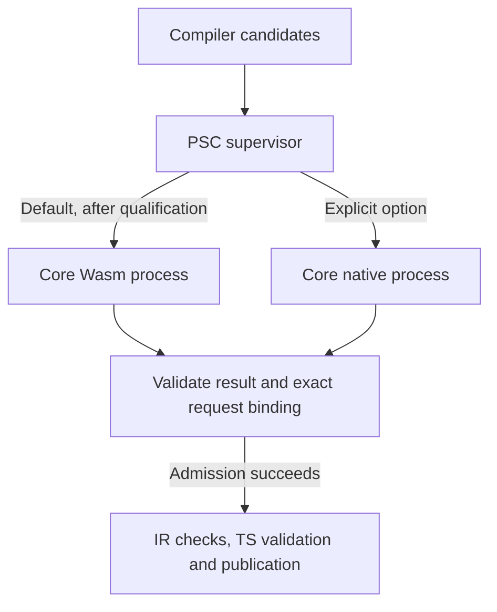

# PSKernel Core: Wasm default, optional native execution

**Execution-order update — 10 October 2026:** investigate and qualify same-source Core → PSC → TS7 → JS before implementing this Wasm provider. [KERNEL_JS_PLAN.md](../../KERNEL_JS_PLAN.md) records the current J0 blocker and J1 gates. Native admission remains selected. This document retains the later Wasm design and qualification obligations; no Wasm or JS default has been promoted.

**Status:** researched architectural recommendation for the user's Wasm-first request. Implementation and default promotion are pending. This document does not announce a new compiler release or a qualified Core Wasm artifact.

**Date:** 10 October 2026, Asia/Jakarta (9 October UTC).

**Evidence cut:** `psc0/platform-v1` at `cb7b241d9387e7d2095f1a2a94db182290f93e09`. The installed preview2 runtime remains `e5c4a561b98ed9e2ae96c7da3f85ed6d844bf1d1`. Its selected native Core source is the separate pinned revision `963030dc2d154008fccc82e7c8ed29331f138799`. Re-read the live branch and active handoff before implementation.

## 1. Recommendation

Make **`pskernel-core-wasm` the required default execution artifact**, after qualification, and offer **`pskernel-core-native` as an explicitly selected optional execution artifact**. Maintain **one `pskernel-core` semantic implementation**, one logical profile, one canonical admission contract and one protected supervisor.

This improves host confinement and can remove the kernel's per-OS executable requirement from the default npm package. It does not establish logical soundness, compiler preservation or executable correctness. Wasm provides a useful execution boundary; the kernel remains the authority whose answers must be correct.

Use Node's existing WebAssembly engine in a release-owned provider subprocess for the first implementation. Prefer a small memory-based admission interface with explicit imports. A pinned Emscripten launcher can establish build feasibility, but its actual imports and host capabilities must meet the same security requirements before default promotion. Do not add Wasmtime, a component-model framework or a general kernel-plugin registry without a concrete requirement.

The existing TypeScript reference backend and compiler self-host cycle remain as selected. Compiling the external kernel artifact with Lean/C/Emscripten is a release-production step, not a requirement to add PSC's optional Wasm backend to the compiler's self-host imports.

## 2. Existing implementation and evidence

| Inspected component | Existing behavior | Implication |
| --- | --- | --- |
| Preview2 release | One product contains the F compiler and separately pinned Linux x64 / Windows x64 native Core executables. | The product is still native-backed. No default switch has happened. [R1] |
| Pinned Core admission | Decodes canonical admissions, constructs a freshly checked prelude and checks each declaration through `psKernelV1AdmitDeclaration`. Failure returns no successful session. | This pure function is the correct porting seam. [R2] |
| Pinned process entry | A small `IO` wrapper reads stdin, calls the checker and writes a JSON response. | Replace or supplement the transport without rewriting kernel rules. [R3] |
| Default Core capability | `nativeEvaluator = Option.none`. | Native executable selection must not enable semantic native reduction. [R4] |
| Existing `pskernel-lean-wasm` | Lean 4.34 C++ kernel, protocol `pskernel-lean/1`, provider `lean4-cpp`; Emscripten 6.0.9. | Reuse cross-build techniques, not its checking identity or artifact as Core. [R5] |
| Existing command guests | A 44-byte, no-memory scheduling function under `psc-command/1`. | This deliberately tiny extension profile cannot host a kernel. Keep it separate. [R6] |

The pinned Core package has 79 source modules; inspection of the native entry's import graph finds 78 of those modules plus the admission/bridge dependencies. The checker has a source-level separation from its process IO. This supports feasibility, but does not prove a small linked runtime: implicit Lean Init, generated initialization and runtime libraries still require inspection. [R14]

The existing Lean Wasm artifact is 2,177,471 bytes, with a 69,410-byte CommonJS launcher. Those are measured identities of the **other checker**, not an estimate of a future Core binary. Its manifest records source `1b21b2483df7e8de7542873c24eaff2501539b1b`. [R5]

Historical cloud evidence has different scopes:

- [Run 36933643176][R7] successfully completed an earlier Lean-kernel Wasm build and qualification. It is useful infrastructure evidence, not a Core Wasm result.
- In [run 37014379617][R8], current-bundle verification, real admission and the host-test step succeeded. The overall run was **cancelled during its Wasm-checked fixed-point step**. Do not call it a completed Wasm self-host result.
- The Core M4 record describes a `UInt8.ofNat` prelude mismatch with the older Lean Wasm snapshot. Thus even compatibility of the accepted declaration envelope cannot be inferred from the shared Lean version. [R9]

No inspected artifact demonstrates the currently selected Core checker in Wasm. The separate Lean 4.35 Arena work is also a different source/profile/protocol workstream; it is not part of this port.

## 3. What “safer” means

Keep four claims separate:

| Claim | Effect of a Wasm default |
| --- | --- |
| Host memory and capability confinement | Improves when the engine enforces Wasm memory/control rules and the embedding exposes only the approved imports. |
| Logical soundness and relative consistency | No automatic improvement. These concern the logical rules, assumptions and their implementation. |
| Faithful execution of the proved checker | Requires the compiler/runtime/ABI/engine assumptions or corresponding refinement results. |
| Availability and resource control | Requires explicit budgets and termination. Wasm validation alone does not bound work or total process memory. |

Wasm checks accesses against linear-memory boundaries, but a C/C++-style overwrite can still corrupt another object **inside the same linear memory**. A corrupted proof-checker state can produce a wrong answer without escaping its sandbox. Bounds checking is therefore not a proof of correct admission. Wasm engines and host bindings can also have bugs. [E1] [E6]

A pure checker needs candidate declarations, an approved logical profile and bounded computation. It does not need project directory access, networking, package loading, child-process creation, arbitrary callbacks, output publication or authority over PSC's reporting.

This benefit depends on the embedding. Emscripten's NODEFS can expose the real filesystem; its generated JavaScript is ordinary privileged host code unless deliberately constrained and trusted. The current repository build links `nodefs.js`. [R15] Generic `node:wasi` is not an adequate security justification: the pinned Node documentation explicitly disclaims comprehensive filesystem sandboxing. [R10] [E2] [E3]

A dedicated Node child adds crash and lifecycle separation. It is not itself an OS filesystem sandbox. The Wasm guest's confinement comes from the engine plus the actual imports and adapter. A Wasm engine escape could still compromise the child's OS authority. Stronger OS resource or filesystem containment would need its own platform-qualified mechanisms.

## 4. Source and package boundaries

| Name | Responsibility | Distribution |
| --- | --- | --- |
| `pskernel-core` | One canonical semantic source, logical contracts, admission code and owned assurance library | Source boundary; publishing a runtime source package is not required for ordinary compiler use |
| `pskernel-core-wasm` | Prebuilt Core Wasm, precise build identity, required adapter metadata | Required default artifact component of `proofscript` after promotion |
| `pskernel-core-native` | Qualified native executables for the same source/profile/capabilities | Explicit optional artifact package |
| `psc` | Protected selection, request binding, limits, results, disclosure and publication | Existing supervisor, delivered by `proofscript` |
| `pscore`, `psfrontend`, `psbackend-ts` | Existing planned compiler responsibilities | Unchanged by this execution choice |

These are the requested ps-prefixed basenames. Only ownership of `proofscript` is established in this conversation. Other public names or a scope must be controlled before publication.

Initially, bundle the Wasm payload under `proofscript` if that avoids premature independent packages. A later split can make `pskernel-core-wasm` an exact required dependency. A guaranteed default must not be an optional dependency whose absence silently disables checking.

Do not copy the 79 kernel sources into two maintained implementations. Generate both artifacts from the selected canonical source and record that source closure in their provenance. Share genuinely identical cross-build support at one internal script location when both consumers need it; do not create a general build framework.

### Proposed user experience — not current preview2 commands

Ordinary installation remains:

```sh
npm install --global proofscript
psc init my-app
```

After Wasm promotion, normal `psc check` and `psc build` use Core Wasm automatically. Users need Node and the installed product; they do not need Lean, Emscripten or native compilation tools.

For an approved, published native package, the proposed explicit workflow is:

```sh
npm install --save-dev --save-exact --ignore-scripts pskernel-core-native
psc build src/Main.ps --kernel-runtime native
```

The package name above is illustrative until ownership/publication is settled. The proposed `--kernel-runtime wasm|native` changes execution of the selected Core, not its logical theory. It is not implemented in preview2.

Resolve the optional native package from the selected project's direct installed dependency and lock data, then authenticate the actual target payload against the compiler release's approved inventory. The resolver must not import its JavaScript entrypoint, run install hooks, download a missing provider, search arbitrary ancestor/global locations or accept a self-declared kernel manifest as authority. An unsupported/missing native artifact produces a clear refusal.

A root configuration field can follow if repeated selection warrants it. Begin with one explicit CLI choice and the release default; avoid introducing another configuration file.

### Open extensions remain open; admission authority remains protected

Third-party npm packages can provide libraries, tactics, language producers, backends or development commands through their declared interfaces. Packaging code as Wasm does not authorize it to become the trusted checker.

A third-party checker can produce advisory results or certificates that an approved validator checks. Making it authoritative requires a separate distribution/profile qualification decision. The trust rule applies equally to first-party packages: an official-looking name does not establish correctness.

## 5. Execution and admission boundary

Retain `proofscript-checked-admissions/2` and the existing admission meanings. Add the execution choice behind the existing protected provider interface, rather than adding a second compiler pipeline.



The supervisor selects the artifact before checking, captures the exact request, applies the profile, launches the provider and validates the bounded result. Only it can create authoritative admission state or commit outputs. A guest never receives the publisher or an object it can mutate to claim checked status.

Keep the host API small: one complete canonical admission batch and one result. Preserve the current fresh-prelude/fresh-session transaction for the first version. Do not add persistent kernel servers, cross-project state, a general RPC bus or a caching protocol until a measured need justifies their invariants.

### Minimal Wasm adapter

Prefer a small private interface for initialization, bounded input allocation, one admission check and bounded result bytes. Reuse the existing canonical codec and admission function. A new general AST encoding or public component-model ABI is unnecessary.

For a memory-based adapter:

- Instantiate only captured bytes whose digest matches a release-controlled expected digest; do not hash one file and later execute a newly read replacement.
- Validate imports/exports and required Wasm features before execution. Construct only the approved imports; do not spread an unrestricted runtime object into the instance.
- Keep memory private to this provider. No shared memory, tables or references with extension instances.
- Bound input and output before copying or decoding. Validate pointer/length ranges using non-overflowing checks and refresh views after possible memory growth.
- Decode returned UTF-8/JSON strictly, reject contradictory or malformed responses, and discard the instance after the batch.
- Treat initialization, allocation, invocation and response extraction failures as no admission.

A first build probe may use the old command-line transport to demonstrate that the actual Core compiles. That milestone alone does not satisfy the minimal-import promotion gate. If a pure adapter requires disproportionate runtime surgery, record the exact required glue/imports and compare alternatives; do not silently grant broad host access to declare the port complete.

### Runtime policy

Use `process.execPath` with a release-owned runner and captured request bytes. Do not inherit arbitrary Node preload settings, caller-selected loaders or package code. Child stdout/stderr are bounded protocol/diagnostic data, not direct terminal authority.

Preserve semantic fuel 131072 and the current default logical capabilities. That fuel bounds the checker work which actually consumes it; it is not V8 instruction fuel or a total cost bound. Parsing, prelude initialization, bignum operations, module compilation and allocation require separate coverage.

Retain a parent-enforced deadline no larger than the current 60-second admission ceiling, covering the whole provider lifecycle. Define finite input/output/module, stack, table and linear-memory limits before qualification and record their exact values. Select numerical memory/size caps from the measured current compiler corpus with explicit headroom; never automatically increase them after a failed check.

Node worker `resourceLimits` do not bound external ArrayBuffer allocations and do not guarantee process survival under global OOM. A Wasm linear-memory maximum also does not bound all JIT, glue or OS allocations. Do not claim a hard total-RSS limit without an OS-enforced implementation. [E4]

## 6. Identity, reporting and failure policy

Separate the following identities:

1. Logical Core family, theory/profile, prelude and permitted axioms/capabilities.
2. Canonical admission/response protocol.
3. Semantic source revision and source-closure digest.
4. Executable artifact digest, target and build/runtime dependencies.
5. Selected runtime, adapter digest and actual engine version.
6. Exact request digest and the host-owned transaction.

The current response code hardcodes `provider: "pskernel-core-native"`. A Wasm wrapper must have an explicit truthful execution identity; do not ship Wasm under a native label. Preserve logical-family/profile comparison separately from artifact identity and adapt the strict host validator deliberately. The existing `pskernel-core/1` admission protocol need not be replaced merely to express a transport choice. [R11]

The supervisor reports the selected/attempted/executed kernel identity in status and receipts, alongside the existing mandatory extension disclosure. Hashes and import/capability records come from inspected bytes and host policy, not from guest assertions. A lockfile hash or manifest accompanying a malicious payload cannot approve that payload: the expected identity must be anchored in the protected distribution.

For both runtime choices:

- A logical rejection stays a rejection.
- A timeout, trap, malformed result, missing provider or exhausted budget means admission was not obtained.
- No automatic native retry after Wasm rejection or operational failure.
- No “accept if either checker accepts” mode.
- A deliberate user rerun with another approved runtime is a new, disclosed transaction.
- Differential disagreement blocks qualification. It cannot authorize taking the more permissive result.
- Kernel failure leaves the previously committed generated output and receipt intact.

Switching to native execution must keep `nativeEvaluator = none`. The optional native-reduction capability is separately listed as acceptance-affecting in Core's TCB inventory; it is not enabled by running an executable. [R4] [R12]

## 7. Practical build route

Start from the selected native source `963030dc…`, preserving kernel algorithms. Treat a newer canonical kernel integration as a separate source-reconciliation task.

The least speculative route is:

1. Reuse the established Lean 4.34/Emscripten 6.0.9 build pins and width-correct build method.
2. Emit the actual Core + admission closure for wasm32.
3. Link only the required generated code and runtime initialization graph.
4. Supply a thin Core-specific entry/adapter.
5. Inspect and qualify the resulting Wasm artifact and glue before product integration.

The existing recipe uses a runnable **native i386 stage0 emitter** plus a **target-width stage1 sysroot**, rebuilt from current pinned Lean sources. Its documented ABI and scalar-literal corrections are necessary evidence to study; simply running the installed x64 Lean compiler and relinking its C as Wasm is not a demonstrated correct route. [R10]

Do not blindly carry the entire old Lean-C++ checker, Lean frontend, compiler, stock global initializer or NODEFS into the Core runtime. Conversely, absence of `import Lean` in the Core source does not prove those libraries disappear at link time. Produce a link map, actual import/export inventory and runtime-dependency list.

The old recipe uses `USE_GMP=OFF`. Reusing the built-in bignum path can avoid an additional cross-library dependency, but bignum correctness remains part of execution trust. Upstream Lean 4.34 explicitly documents correctness problems with older GMP versions; neither an unpinned arithmetic library nor unchecked `Nat`/integer width conversion is acceptable. Pin arithmetic/runtime configuration and test boundary values. [R10] [E5]

Producer dependencies can remain substantial: Lean bootstrap sources, CMake/Clang, Emscripten and i386 build support. Keep them out of consumer installation. Ordinary npm install must use a prebuilt and work with `--ignore-scripts`.

## 8. Alternatives and tradeoffs

| Option | Benefits | Costs / limits | Decision |
| --- | --- | --- | --- |
| Current native Core | Already qualified on Linux/Windows x64; simple existing process protocol | Per-platform artifacts; native execution has broader host consequences if compromised | Preserve as baseline and explicit optional runtime |
| Core Wasm in release-owned Node child | Uses installed Node/V8; portable module; constrained guest memory/imports; preserves process-shaped boundary | New cross-build/ABI qualification; startup/IPC/JIT cost; still trusts Node/adapter | Preferred first default target |
| Core Wasm in a Node Worker | Can reduce process overhead and permit later reuse | Worker limits are not total memory isolation; a fatal engine failure can affect supervisor | Reconsider only after measurement and explicit risk review |
| Core Wasm in Wasmtime | Dedicated embedding, instruction fuel and interruption controls [E7] | Adds another native runtime, version/dependency/platform packaging and maintenance | Alternative if a concrete resource or embedding requirement demands it |
| Core through PSC's own Wasm backend | Long-term alignment with compiler/kernel self-host and backend proofs | Current Core target correctness and fixed point are not established | Later independent milestone |
| Relabel existing Lean Wasm as Core | Reuses an existing file | Different checking implementation, identity and prelude coverage | Reject |

Performance is unknown until Core measurements exist. Wasm may save multi-platform payload duplication while adding compile/startup or memory overhead. Native may be preferable for particular large workloads. Report cold and repeated batch latency, full-F admission time, peak memory and installed/archive bytes on the same machine/runtime; do not borrow the other kernel's numbers as a prediction.

One portable kernel payload does not automatically qualify the entire compiler for macOS, ARM64, every Node release or browsers. Node, the TS7 dependency, host filesystem behavior and installation still need platform tests. Browser execution additionally needs a browser adapter and its own lifecycle/resource contract.

## 9. Self-hosting remains intact, with an honest boundary

The existing demonstrated compiler is the 61-module F closure, source `fcd875c8f38db4b0524090bd10c7c2fd5024053d`, closure SHA256 `6306cdac131f849a9a96de3dc4d628a48b953072b45fc6cc829075bd90b67ac7`. Selected seed R remains `fe2560aba0f347b1caf8d000d371464642d44f23`. Bootstrap remains Node22.23.3 / Lean4.34.0 / TypeScript7.0.2. [R13]

Changing the external provider's execution target does not inherently change these compiler sources or the required TypeScript backend. The kernel artifact can be produced separately and then used by the checked release pipeline.

Nevertheless, a default Wasm admission route needs its own qualification. Replay the exact retained F admission streams and bind their existing identities to the new artifact. Historical native receipts must remain historical; do not relabel them as Wasm acceptance.

A compiler fixed point, a generated kernel artifact and a **joint self-hosted compiler-plus-kernel fixed point** are different results. Lean/C/Emscripten production of Core Wasm does not establish that PSC compiled its own kernel. The latter can be pursued through a separately qualified backend later.

Do not rerun the full multi-generation compiler qualification for documentation or an unchanged producer-only investigation. Run affected provider/package gates at a coherent promotion checkpoint. A changed compiler closure or explicitly stronger self-host claim requires its relevant full gate.

## 10. Proof organization and obligations

Use the agreed `psc0/proofs/**/*.proof.lean` layout, with reusable models in ordinary `.lean` modules and full Lean tactics available outside the bootstrap/runtime closure. Reuse the canonical kernel proof library at an explicit source/profile revision; do not copy it for each artifact.

| Proof area | Shared work | Execution-specific obligation or assumption |
| --- | --- | --- |
| Logical model / relative consistency | Foundation, universe/rule/axiom model | Runtime choice supplies no consistency theorem |
| Kernel admission and implementation refinement | Same source checker, invariants and capability policy | Runtime representations and primitive operations must satisfy the assumed meanings |
| Canonical decoding and prelude | Same declarations, names, levels, integers and order | UTF-8, lengths, memory boundaries and initializer correctness |
| Compiled artifact refinement | Statement connects executable acceptance to source-checker acceptance | Lean erasure/C compilation, C/C++ ABI/runtime, LLVM/Binaryen/Wasm translation, bignums and engine |
| Host transaction and isolation | Request/result binding, exclusive authority and publication conditions | Actual import semantics, lifecycle and resource enforcement |
| Compiler/PSCV/backend correctness | Existing separate preservation and coverage ledger | Moving the kernel to Wasm does not discharge it |
| Joint bootstrap correctness | Declared compiler/kernel source/artifact relation | Not established by building the kernel with external Lean/Emscripten |

A useful eventual composition statement is:

> For exact request bytes B and fixed logical policy P, if decoding preserves the declared meaning, the selected executable's successful result refines the source checker, the source checker has the required admission theorem, and the host binds that result to B and P, then successful host admission satisfies the source-level kernel property.

The source theorem can be reused across targets when its assumptions match. **The executable-refinement premise is substantial.** A small adapter proof does not prove Lean-to-C, runtime arithmetic, the C-to-Wasm optimizer chain or V8 correct.

Wasm module validation establishes structural/execution well-formedness, not PSKernel logical correctness. Native/Wasm differential testing establishes behavior on the tested corpus, not universal equivalence. Equal bytes across clean builds establish reproducibility, not correct compilation. A Wasm sandbox alone cannot justify accepting an arbitrary replacement kernel.

Formal assurance stays a **later gate for stronger claims**, not a prerequisite for ordinary implementation completion. The mandatory runtime checks, authentic artifact boundary, bounded execution and installation tests still gate a default release. Existing false assurance flags must not be changed merely because Wasm is now used.

## 11. Bounded implementation sequence

| Stage | Work | Completion evidence |
| --- | --- | --- |
| W0: prove build feasibility | Compile unchanged selected Core with a thin Wasm entry; reuse pinned width/ABI infrastructure | Real cloud build; truthful Core identity; positive and negative admission; link/import/runtime inventory; measured size/cost |
| W1: qualify provider boundary | Implement the minimal adapter, exact payload binding, limits, strict result validation and disclosure | Existing Core corpus plus memory/codec/exhaustion/tamper/refusal cases pass through the actual runner |
| W2: integrate installed product | Add Wasm as a qualified candidate; package optional native payload; explicit runtime choice; preserve checked publication | Fresh installed-package matrix, current full-F admission replay, same-policy native comparison and output-preservation tests |
| W3: promote default | Select the fully qualified Wasm artifact as release default and document exact platform/runtime support | One reviewed release inventory; exact artifact retained; consumer workflow passes with no Lean/Emscripten/native Core executable |
| Later assurance | Mechanize stable contracts and improve executable-refinement coverage | Individually scoped theorems and assumptions, without retroactive claims |

Start with one cold cloud cross-build before committing to the implementation estimate. A provisional envelope is approximately **1,000–2,500 new/edited implementation and focused qualification lines**, excluding generated code, relocated/shared existing build scripts, documentation, full formal proofs and unforeseen upstream runtime fixes. Indicative allocation: 100–250 entry/ABI lines, 200–450 host/identity lines, 250–650 build/CI lines and 300–800 focused test/evidence lines. This is a planning range, not measured work.

Target **zero semantic kernel changes** for W0–W3. If porting exposes a real checker defect, diagnose it under the owning kernel workstream and requalify the canonical implementation; do not hide a target-specific semantic patch in the Wasm wrapper.

## 12. Measurable default-promotion criteria

1. **Exact source:** both runtimes identify the same selected semantic source/profile/prelude/capabilities. No hidden native evaluator or unchecked declaration insertion.
2. **Real artifact:** retained Wasm and all required glue have recorded byte counts/digests, pinned build inputs and complete import/export/feature inventories. No placeholder or renamed Lean-C++ kernel.
3. **Correctness corpus:** every supported positive fixture is accepted; every required negative fixture is refused; the complete current F admission streams pass. Include structured names, universe levels, large/negative integers where supported, 32-bit scalar boundaries and late-declaration corruption.
4. **Defined comparison:** native and Wasm agree on required decisions and structured error categories under the same semantic budgets. Distinguish diagnostics from decisions in the published contract before running the gate; do not weaken a failed gate afterward. Operational exhaustion must stay separately visible.
5. **Confinement:** no guest access to project files, network, process spawning, dynamic loading or terminal control. Every required import and its authority is enumerated. Foreign/extra imports and wrong artifacts are refused before checking.
6. **Failure preservation:** traps, timeouts, memory/stack exhaustion, oversized requests/replies, stale payloads, malformed/contradictory results and cancellation create no admission and no new output/receipt. No runtime fallback.
7. **Resource evidence:** finite budgets are frozen and recorded; parent deadline covers startup through completion; actual memory/latency measurements are published with their platform and runtime identities. No undocumented RSS guarantee.
8. **Installed consumer:** the same default Wasm bytes work in fresh Linux x64 and Windows x64 Node22.23.3/26.7.0 installations with `--ignore-scripts`, no source checkout, Lean/Emscripten or native Core payload requirement. Other targets are advertised only after their own complete product tests.
9. **Optional native:** installation alone leaves Wasm selected. Explicit native selection accepts only release-approved target bytes and yields truthful runtime/capability records. Missing/unapproved native payloads refuse clearly.
10. **Bootstrap preservation:** unchanged F closure/seed hashes are checked; new Wasm admission evidence is recorded separately; no inferred joint fixed point or changed formal-assurance flags.
11. **Reproducibility:** two clean producer builds with the same inputs produce identical complete Wasm/glue digests. If they differ, investigate before claiming this promotion gate complete; an explicitly labeled experimental preview can still record the functional result. Retain exact qualified artifacts regardless.
12. **Maintainability:** one semantic source, one admission codec/contract and one checked host path; no extra mandatory npm runtime dependency beyond what the chosen embedding actually needs.

## References

[R1]: https://github.com/dwijayuda/pskernel/blob/cb7b241d9387e7d2095f1a2a94db182290f93e09/psc0/release/release.json
[R2]: https://github.com/dwijayuda/pskernel/blob/963030dc2d154008fccc82e7c8ed29331f138799/psc0/host/src/Ps/Host/KernelCoreProvider/Admission.lean
[R3]: https://github.com/dwijayuda/pskernel/blob/963030dc2d154008fccc82e7c8ed29331f138799/psc0/host/src/Ps/Host/KernelCoreProvider/Main.lean
[R4]: https://github.com/dwijayuda/pskernel/blob/963030dc2d154008fccc82e7c8ed29331f138799/psc0/packages/pskernel-core/src/Ps/KernelCore/API/Provider.lean
[R5]: https://github.com/dwijayuda/pskernel/blob/cb7b241d9387e7d2095f1a2a94db182290f93e09/psc0/packages/pskernel-lean-wasm/PREBUILT_WASM_MANIFEST.json
[R6]: https://github.com/dwijayuda/pskernel/blob/cb7b241d9387e7d2095f1a2a94db182290f93e09/psc0/docs/platform/command-extension-sdk.md
[R7]: https://github.com/dwijayuda/pskernel/actions/runs/36933643176
[R8]: https://github.com/dwijayuda/pskernel/actions/runs/37014379617
[R9]: https://github.com/dwijayuda/pskernel/blob/cb7b241d9387e7d2095f1a2a94db182290f93e09/psc0/packages/pskernel-core/M4_ACCEPTANCE.md
[R10]: https://github.com/dwijayuda/pskernel/blob/cb7b241d9387e7d2095f1a2a94db182290f93e09/psc0/packages/pskernel-lean-wasm/BUILDING.md
[R11]: https://github.com/dwijayuda/pskernel/blob/963030dc2d154008fccc82e7c8ed29331f138799/psc0/host/src/Ps/Host/KernelCoreProvider/Protocol.lean
[R12]: https://github.com/dwijayuda/pskernel/blob/963030dc2d154008fccc82e7c8ed29331f138799/psc0/packages/pskernel-core/PSKERNEL_TCB.json
[R13]: https://github.com/dwijayuda/pskernel/blob/cb7b241d9387e7d2095f1a2a94db182290f93e09/psc0/AI_WORK_STATE.md
[R14]: https://github.com/dwijayuda/pskernel/tree/963030dc2d154008fccc82e7c8ed29331f138799/psc0/packages/pskernel-core/src/Ps/KernelCore
[R15]: https://github.com/dwijayuda/pskernel/blob/cb7b241d9387e7d2095f1a2a94db182290f93e09/psc0/packages/pskernel-lean-wasm/scripts/build-wasm.sh
[E1]: https://webassembly.org/docs/security/
[E2]: https://emscripten.org/docs/porting/files/file_systems_overview.html
[E3]: https://nodejs.org/download/release/v22.23.3/docs/api/wasi.html
[E4]: https://nodejs.org/download/release/v22.23.3/docs/api/worker_threads.html
[E5]: https://github.com/leanprover/lean4/blob/293d5d0c0c3f3dded4688b3ccd6a33939ac5102b/src/CMakeLists.txt
[E6]: https://docs.wasmtime.dev/security.html
[E7]: https://docs.wasmtime.dev/examples-interrupting-wasm.html
