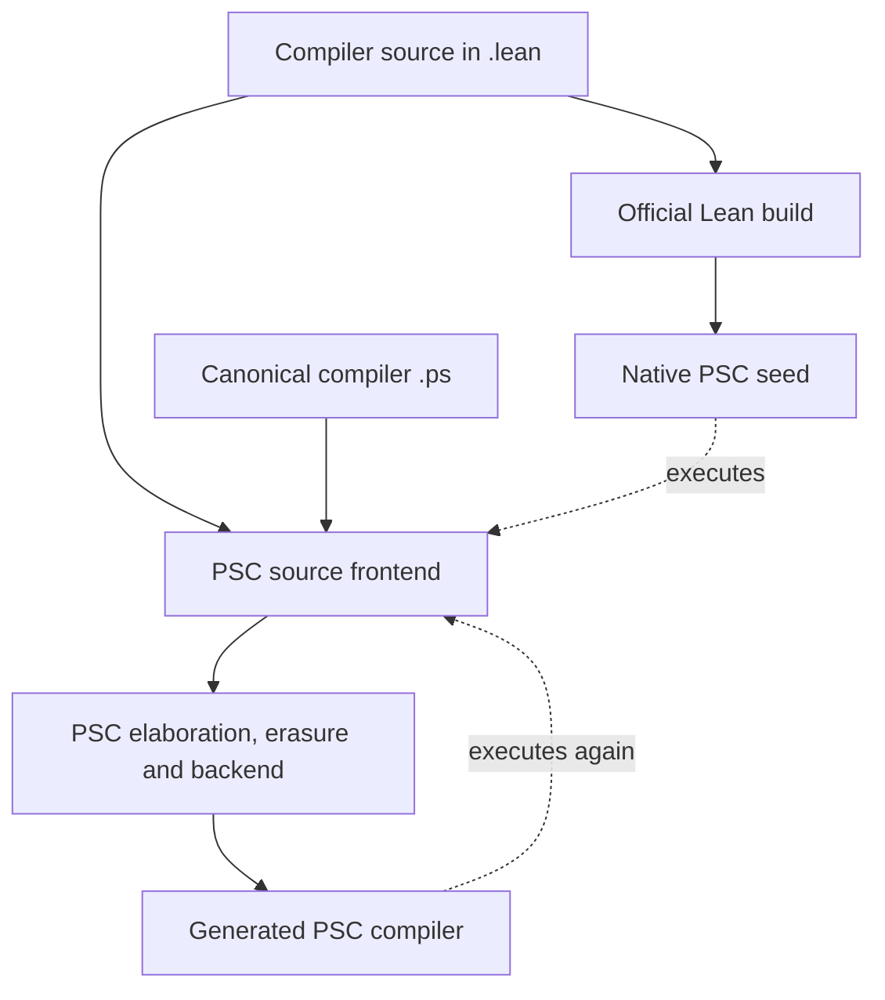

# Why PSCV0 uses restricted self-host source profiles

## Finding

**The awkward source style is primarily an implementation constraint of the present compiler pipeline. Self-hosting does not inherently require it.** The current compiler makes authors spell out normalization, type information, recursion motives, and library dependencies that a more complete frontend would ordinarily derive.

The two named profiles preserve a source envelope that has produced successful compiler fixed points:

- `PSC1-selfhost-stable/1` protects the main compiler/bootstrap closure.
- `PSC1-portable-selfhost/1` extends the discipline to explicitly tagged non-bootstrap packages and their imports.

Removing those policies alone would leave the parser, elaborator, erasure, runtime-library and backend limitations in place. The useful architectural change is to let ordinary supported PSC1 source lower systematically into well-defined checked Core and runtime forms. [S04] [S05] [S06] [S07] [S08]

## Audit scope and evidence status

- Repository: `dwijayuda/pskernel`.
- Inspected `main` commit: `37f63c39d4a07189938046c64152bba25d789450`.
- Inspected `pscv0` tree: `d0851a233b83585a786c2413acf2d917a4370ba4`.
- Research date: 2026-10-08 UTC / 2026-10-09 Asia/Jakarta.
- Method: GitHub source, manifest, history, checked-in test and CI-evidence review; independent reviews of profiles, frontend/recursion, and backend/runtime boundaries.
- Execution status: **no fresh compiler build, test execution, or fixed-point run was performed in this audit**. Statements about existing tests describe what those tests assert. Historical CI observations below were checked against their GitHub job results; the evidence review also inspected their logs.
- Changes in this research checkpoint: this report and a research entry in `AI_WORK_STATE.md`. No compiler, kernel, provider, profile, test or workflow implementation changes.

The requested folder is **`pscv0`**, which is distinct from `psc0`. Its README and work-state file describe a V6 staging workspace copied from the earlier PSCV execution work. They explicitly say that reorganizing the source did not implement or certify V6. Its proposed native distribution architecture treats self-hosting as a later evidence lane. Historical material under `legacy/` supplies provenance, not a replacement for current V6 authority. [S01] [S02]

## 1. Resolve the overloaded names first

“Normal PSC1” can mean several different things in this repository:

| Name or usage | Meaning at the inspected snapshot |
| --- | --- |
| Historical PSC1 language reference | A repository-derived language/capability draft with required, optional and open freeze obligations. It is broader than the demonstrated self-host corpus. |
| A file ending in `.lean` | Either source compiled by official Lean during bootstrap, or source consumed by PSC's own bounded Lean-shaped frontend. These are different operations. |
| `ps-standard-0.9-r3` / `ps-0.9-r3` | Source/edition identities retained in current bootstrap configuration. |
| `PSC1-selfhost-stable/1` | Compiler implementation-source policy, not a second public language grammar. |
| `PSC1-portable-selfhost/1` | Additional policy for tagged portable non-bootstrap implementation packages and their import closure. |
| PSCV / V6 target | Broader language, verification and distribution goals; completion is not claimed by the present source layout. |

The distinction is explicit in `language-authority.json`: it records source-language identities separately from `implementationProfile`, and still labels the implementation as the PSC2/bootstrap milestone pending the full PSCV verification closure. The historical `PSC1 Lang` reference also warns that parser support, backend support and language conformance are distinct. [S03] [S09]

For this analysis, **ordinary PSC1 authoring** means readable, intentionally supported functions, accumulators, local bindings, patterns, collections and effects. It does not mean every feature of every historical PSC1 draft, nor arbitrary Lean source.

## 2. The native seed and the self-host frontend have different capabilities

Official Lean initially builds the compiler implementation. When that compiler later reads source, it runs PSC's own frontend:

1. `psParseLeanSource` or `psParseProofScriptSource`.
2. The shared `PsSyntaxModule`.
3. `psElabModule` / `psElabDeclarationBatch`.
4. The selected PSC self-host prelude.
5. PSC declaration preparation, erasure, runtime-IR validation and target emission.

This dispatch is present both in the compiler API and in the native host. The native host does not call official Lean's elaborator in this source-processing path. [S07] [S08]



The diagram shows the critical distinction: an implementation can be valid input for official Lean while exceeding the source language understood by the compiler it produces.

Both PSC source spellings converge on the same limited elaborator. Renaming or translating a handwritten file to `.ps` does not repair an unsupported recursive definition, missing library declaration or unavailable runtime representation. The existing dual-source structural-recursion test deliberately checks that both frontends elaborate an explicit-match definition to the same Core declarations. [S10]

### Native speed and kernel choice

Building the existing PSC implementation as a native executable can reduce execution overhead. It does not add missing syntax, type inference, recursive-definition elaboration or target representations.

Similarly, substituting `pskernel-core` for another checking provider does not change these frontend and backend functions. Kernel checking can validate the terms it receives; it cannot elaborate source that PSC rejected before producing those terms. Adding a kernel's implementation to the generated source closure is a separate self-host claim. The bootstrap roots explicitly keep kernel checking and host orchestration outside their compiler-only closure. [S07] [S08] [S29]

## 3. The dominant source restriction: varying recursive parameters

### 3.1 The declaration recognizer requires a particular AST shape

`psElabStructuralRecursionFromSource` recognizes a definition only when its body is directly a match expression, the scrutinee is directly a reference, and that reference resolves to one of the definition's explicit header parameters. A lambda, leading let or conditional at the outermost body position does not enter this recognition path. [S11]

This is more specific than the mathematical condition that recursive calls decrease structurally.

### 3.2 Nondecreasing explicit arguments must be identical locals

The recursive-call validator requires:

- the chosen decreasing argument to resolve to a registered recursive constructor-field local;
- every other explicit argument to resolve to its original local identifier;
- the call to have the exact number of explicit header arguments.

It does not generally elaborate new accumulator expressions and build a recursive hypothesis that accepts them. Failures include `structuralRecursionNotDecreasing`, `structuralRecursionInvariantArgument`, and `structuralRecursionArity`. [S12]

There is a direct checked-in regression test for a terminating definition that changes a nondecreasing parameter:

```lean
def badInv (base : Nat) (xs : ListInv Nat) : Nat :=
  match xs with
  | ListInv.nil => base
  | ListInv.cons head tail => badInv head tail
```

The list argument decreases from `xs` to `tail`. The test nevertheless expects `structuralRecursionInvariantArgument` because `base` changes to `head`. This is a recorded implementation restriction, not a newly executed example. [S10]

### 3.3 Why the unusual curried worker works

The portable-profile regression suite contains an even more directly useful pair. It rejects this source shape:

```lean
def fold
    (step : Nat -> Nat -> Nat)
    (values : List Nat)
    (state : Nat) : Nat :=
  match values with
  | List.nil => state
  | List.cons value rest =>
      fold step rest (step state value)
```

It accepts this shape for the structural-call policy:

```lean
def foldWorker
    (step : Nat -> Nat -> Nat)
    (values : List Nat) : Nat -> Nat :=
  match values with
  | List.nil => fun (state : Nat) => state
  | List.cons value rest =>
      let smaller : Nat -> Nat := foldWorker step rest;
      fun (state : Nat) => smaller (step state value)
```

These are the repository's own test examples. The assertion concerns the static structural-call rule; it is not an independent execution or preservation proof. [S13]

In the second form, the changing state is a parameter of the **returned function**, rather than an explicit parameter of the recursive definition. The recursive call keeps `step` unchanged and decreases only `values`. The induction hypothesis has type `Nat -> Nat`, so applying it to a new state is ordinary function application.

The `smaller` binding also separates the exact-arity recursive call from the later function application. The real foundation library uses this same mechanism for reverse, map, folds and fuel-based workers. [S12] [S14]

### 3.4 Why deleting the check would be wrong

The current elaborator replaces a validated self-call with its registered induction-hypothesis variable. It does not apply that hypothesis to newly changed accumulator arguments. Simply permitting those arguments would therefore fail to implement the requested source semantics.

A real solution must construct an appropriate function-valued motive, generalize the varying parameters, type the induction hypotheses, and apply them to the new arguments. The erasure pass must understand the same parameter mapping. Its current recursor handling identifies a recursive parameter through the current definition's runtime parameter list and reconstructs self-calls from that information. [S12] [S25]

Official Lean's recursion elaborator already provides much more general structural and well-founded recursion machinery. That comparison supports the diagnosis that this is missing elaborator work; it does not imply that the small PSC compiler already contains that machinery. [X01] [X02]

## 4. Equation syntax exposes a parser/elaborator disconnect

The Lean-shaped parser has equation-clause lowering. However, `psLeanLowerEquationValue` wraps the generated match in a lambda. The structural-recursion recognizer described above expects a match at the outermost body position.

The positive equation-definition test uses a **nonrecursive** two-argument Boolean function. It therefore establishes a narrower capability than recursive equation compilation. [S15] [S10]

This explains why “the parser accepts equations” and “recursive compiler source cannot use equation-style definitions” can both be true.

The general fix is to bring explicit-match, lambda-wrapped and equation-style declarations through one resolved declaration/recursion analysis. Adding more grammar productions alone would leave this disconnect.

## 5. Other readability restrictions have identifiable causes

| Source feature | What the inspected code actually supports | Why explicit source is used |
| --- | --- | --- |
| Unannotated match-valued let | An unannotated let elaborates its value with no expected type; match elaboration requires an expected type. | `let result : ResultType := match ...` supplies missing information. |
| Untyped lambda binder | Both parsers require typed lambda binders in this path. | Authors write `fun (value : T) =>`. |
| Nested constructor patterns | Constructor patterns contain a list of binder names, not a recursive tree of subpatterns. | Nested match expressions expose each constructor separately. |
| Numeric tuple projection | The common name parser expects an identifier after a dot. | `Prod.fst` and `Prod.snd` avoid `.1` / `.2`. Named structure projections do exist. |
| General monadic do | The parsers recognize typed `let name : T <- action;` and final `return`, lowering to `compilerBind` / `compilerPure`. | General Lean do statements, mutation and loop elaboration are a larger capability. |
| General source class/instance declarations | Lower-level instance synthesis exists, but the source declaration AST contains definitions, partial definitions, theorems, inductives and structures. | Explicit named operations avoid incomplete source-level class/instance integration. |
| Proposition-based if | The current if elaborator expects a Bool condition and constructs its own Boolean-equality decision. | Explicit Boolean operations match this implemented path. |
| Term operators and conveniences | The portable profile rejects several arithmetic, Boolean, constructor and dot-notation spellings; the underlying frontend is not a general Lean notation elaborator. | Fully named primitives and constructors make semantic dependencies explicit. |

Evidence: let/match and Boolean if [S16]; lambda parser requirements [S17] [S17b]; pattern and declaration AST [S18]; numeric/named projections [S19] [S19b]; limited do lowering [S20] [S20b]; instance machinery/context [S21] [S21b]; portable source rules [S06] [S22].

These distinctions prevent several misleading conclusions:

- There is **some do support**; an all-do prohibition was not established.
- There are higher-order functions, lambdas, generic functions and library traversals.
- There is instance-synthesis machinery, even though a general source class/instance frontend is missing.
- Record literals and named projections exist; a ban on some record/projection spellings does not mean records are absent.
- Controlled `partial def` has a distinct parser/elaborator path and checked-in tests. Replacing total definitions with partial ones would change their logical/assurance role and is not an equivalent readability refactor. [S10] [S14] [S18] [S20] [S21]

Some work here is relatively contained, such as numeric projection lowering. Other work, such as general effect elaboration, dependent matching or class declarations, requires actual semantic infrastructure. Those should not be treated as one undifferentiated syntax task.

## 6. The library available to self-host code is deliberately smaller

The compiler elaborates against `psSelfHostProdPreludeEnvironment`, built from selected PSC declarations. List, Option, Except and Prod support is explicitly assembled, and erasure receives a selected runtime-prelude declaration inventory.

This is not automatic access to all of Lean's `Init`, `Std` or implementation libraries. A call that works when official Lean compiles the handwritten implementation may reference a declaration or runtime implementation missing from the generated compiler's environment. [S07] [S23]

The foundation library addresses this by implementing operations such as `psListMap`, `psListMapExcept`, `psListReverseAcc` and folds in portable source. The functions remain generic and higher-order; their dependencies are visible and reproducible. [S14]

Consequently there are two separate questions for a convenience such as `xs.map f`:

1. Can the frontend resolve and elaborate that source spelling?
2. Is the selected function's implementation included and supported through erasure and the chosen runtime target?

A coherent library extension must answer both. Adding an accepted identifier or a prelude signature without a correct runtime path would not complete the feature.

## 7. Erasure and backend limits matter after source acceptance

The shared runtime IR already represents functions, calls, lets, conditionals, records, projections, constructors and matches. Its intrinsic vocabulary includes array map and fold operations. The profiles therefore cannot be explained by a universal absence of functional-programming machinery. [S24]

There are nevertheless real limits:

- Runtime type erasure returns an unknown representation for some unsupported type shapes, including certain nonconstant-headed type applications. The later validator must reject unresolved runtime types.
- Finishing a partially applied function with an outstanding type binder can report `unsupportedApplication`.
- Recursor erasure recognizes particular relations between the scrutinee, current definition and runtime parameters.
- Closed specialization requires concrete type arguments in its supported generic-call paths and rejects generic calls through unsupported expression heads. [S25] [S25b] [S26]

### Target routes are different

| Target route | Actual implementation route | Material implication |
| --- | --- | --- |
| TypeScript [S27ts] | Validated runtime IR directly to generic TS source | Does not require the closed-instance specializer used by default JS/Wasm. |
| JavaScript, closed representation [S27] | Validated IR -> closed specialization -> JsIR | Ground instantiation and generic-call restrictions apply. |
| JavaScript, uniform representation [S27] | Explicit alternative representation with its own wrapper/selection | This exists in code; its current lowering rejects external imports. It is not permission to weaken closed-specialization invariants. |
| WebAssembly [S27wasm] | Validated IR -> closed specialization -> Wasm lowering | Requires supported ground runtime representations; closure support exists. |
| Rust [S28] | Validated generic runtime IR -> Rust source | Has separate restrictions on nested function shapes, stored/captured functions and external imports. |

These are verified route distinctions, not coverage percentages. [S27] [S28]

For example, the Rust implementation accepts some higher-order uses but restricts nested function parameters/results and captured function values stored in records or ADTs. An ergonomic compiler refactor into records of captured callbacks could expose that boundary even if parsing and ordinary application succeed. [S28]

Source acceptance and runtime cost are also separate. TS uses generator/trampoline machinery for calls, and direct JS contains stack-safe printing paths. A source refactor that preserves a result on a tiny example does not automatically preserve compiler-sized stack or allocation behavior. Performance should be measured for the chosen representation and source closure, not inferred from the presence of `native`, `Wasm` or a profile name. [S30] [S30b] [S30c]

## 8. What each profile actually enforces

There are three overlapping static policy layers:

| Layer | Scope | Enforcement |
| --- | --- | --- |
| Generic PSC1 source audit | Manifest source roots for bootstrap packages by default; all portable packages with `--all-portable` | 20 source-policy rules covering host implementation dependencies and language machinery. |
| `PSC1-selfhost-stable/1` | Import closure of `SelfHost.lean` | 16 forbidden-form rules, a 13-package allowlist, configuration identities and the historical 75 repair-guard filename inventory. |
| `PSC1-portable-selfhost/1` | Every source-root file in explicitly tagged non-bootstrap packages plus imports | Inherits stable forbidden forms and adds 23 structural/source-shape rules. |

The portable profile currently selects 11 packages: JS/Rust/Wasm backends, their three drivers, interface-ir, interface-ts, project, pscv-theory and theory-bridge. Its import closures overlap shared bootstrap modules. It does not silently enlarge the stable bootstrap root. `portable:true` alone is not the same as opting into the named portable profile. [S04] [S05] [S06] [S31]

The stable allowlist contains bootstrap, foundation, syntax, core, environment, meta, elab, bridge, compiler-ir, erasure, compiler, backend-ts and driver-ts. Native hosts, kernels and alternative target roots have separate ownership. [S05] [S29]

### Policy is broader than individual compiler failure cases

The static rules are enforced rejection gates. They provide early feedback but do not constitute a proof of compilation, termination, semantic correctness or self-application.

For example, the portable recursion rule checks that exactly one explicit argument changes to a bare identifier. It cannot establish from that textual property alone that the identifier denotes a decreasing subterm. The elaborator must still verify that relationship. Conversely, a broad spelling ban can reject a form that a particular frontend or target path already supports. [S22]

Stable and portable are not identical restriction sets. The historical standard explicitly allows already-proven forms of equality/Boolean/projection syntax in stable code, while portable has stronger generic convenience restrictions. [S32]

## 9. History explains why these restrictions accumulated

The stable profile was introduced at commit `9954fa0eec36562ccc1cd48ac7a2913ab470d506` on 2026-10-03 UTC. It standardized the already-successful 55-module compiler-only corpus and froze the historical set of 75 repair-guard filenames. The goal was to stop rediscovering incompatible source forms late in expensive self-host runs. [H01] [S32]

Portable `/1` was introduced at `2fbd31e7a8ded413657ad15280a823d489c4c1e5` on 2026-10-05 UTC. Its first manifest contained 11 structural rules; later revisions expanded the list, including recursion, inference, primitive capability and record-update restrictions. The inspected version contains 23. [H02] [S06]

This is evidence of an engineering sequence: establish a working narrow closure, codify its reliable forms, then extend that discipline to additional packages. It does not establish that each rejected convenience is semantically impossible.

A bare profile name is also insufficient to reconstruct a historical boundary: portable `/1` changed while retaining its identifier. Exact source commits and contract bytes are essential evidence. A future capability-profile revision should identify its actual rules and implementations explicitly.

## 10. Two tooling findings affect everyday development

### 10.1 Exact-source guards still preserve particular spellings

`check-selfhost-source-syntax.mjs` uses `text.includes` with required and forbidden multi-line strings for specific definitions. These cover exact binding and worker forms, not only semantic properties. A harmless formatting or factoring change can therefore trip a source guard independently of whether the current compiler could handle the new program. [S33]

The stable profile freezes a set of 75 historical guard filenames. That limits growth in one class of tests; it does not mean all source-specific textual constraints have been replaced.

These checks should be retired individually only after their actual invariant is covered by a meaningful capability or whole-source check. Deleting them without understanding their purpose would discard evidence; keeping exact spelling requirements indefinitely would preserve implementation history as authoring policy.

### 10.2 `selfhost:guard` does not itself compile current handwritten changes

At this snapshot:

- `selfhost:source-fast` feeds `dist/bootstrap/workspace` to the generated compiler and compares the re-emitted source.
- `selfhost:guard` combines that replay with `check:fast`.

The re-emitter reads the existing generated workspace. Unless current handwritten source has first been regenerated into that workspace, the command cannot establish that a current semantic edit compiles or retains a compiler fixed point. This is a limit on what the command proves; it is not a claim that the command is useless. [S34] [S34b]

The repository already contains source-aware alternatives:

- `fixed-point:js` uses `fixed-point-current.mjs`.
- `dev:selfhost:check` uses the resident current-source path.

The current-source fixed-point script translates the current entry first. It reuses earlier evidence only after comparing the canonical source inventory, closure identity and actual file bytes; otherwise it builds the current candidate and the next generation. Those mechanisms are a stronger basis for low-cost authoring checks after establishing a fresh working `pscv0` baseline. [S35]

## 11. What the historical self-host evidence establishes

The inspected tree contains real historical observations:

| Route | Source commit / source closure size | Historical result |
| --- | --- | --- |
| Direct JS | `66ee434217ab1b4bf2501790ada813434cfdd93f`; 65 modules | Generation 1 = 2 = 3 for generated JS source; generation 2 imported and executed. |
| Rust | `9c61a5e6e2761dc0c5fba82be38b22078acd43a2`; 66 modules | Generation 1 = 2 = 3 for generated Rust source; generation 2 compiled and executed. |
| Direct Wasm | `166c6a3fa948cd67f58f9527945879c308764480`; 80 modules | Generation 1 = 2 = 3 for emitted Wasm bytes; generation 2 instantiated and executed. |

The corresponding jobs are JS `112570474936`, Rust `112541632056` and Wasm `112872237530`. Each relevant job reports success. Other jobs in the same workflows can have different conclusions, so a workflow-wide failure/cancellation must not be substituted for the successful target job. [E01] [E02] [E03]

The later Wasm success matters: the earlier generation-2 timeout is historical, not the latest recorded result in this snapshot. The Rust receipt concerns generated Rust-source byte equality, not reproducibility of native executable bytes. [E02] [E03]

These observations concern different, exact compiler source closures. They do not establish:

- self-hosting of every package currently under `pscv0`;
- a fresh run after the V6 copy/reorganization;
- kernel self-hosting;
- full PSCV/V6 conformance;
- global compiler preservation, diverse double compilation, or a certified executable.

The receipts themselves preserve these distinctions. The inspected workflow inventory also does not contain a `pscv0` implementation/fixed-point run; the inherited self-host workflow targets `psc15selfhost`. The separate PSCVL workflow only references `pscv0` for a normative-document hash comparison. [E01] [E02] [E03] [S36] [S36b]

### Source contracts and fixed points are different gates

The stable executable source contract checks the authoritative source closure, translates and reprints canonical `.ps`, checks the generated closure, and compares admission streams and TypeScript text. It does **not** run the generated compiler itself.

The portable contract similarly checks package roots, proves entry-root coverage, emits TS, translates/rechecks canonical `.ps` and compares output. The actual generated-compiler fixed point remains a separate operation. Even `psc check` in this native bootstrap path is labeled admission-ready in the implementation; it must not be relabeled as production certification. [S37] [S38] [S39]

## 12. Can the source become normal PSC1?

**Yes, for a deliberately specified authoring subset, by completing the compiler mechanisms that ordinary source needs.** The present implementation already contains much of the necessary foundation: ADTs, functions, recursion machinery, a shared Core, erasure, validators and multiple backends.

The highest-value change is to move manual source normalization into the compiler. Authors should be able to write a structurally recursive accumulator function while the elaborator constructs the same kind of well-typed recursor program that the current worker form expresses by hand.

This is a design recommendation inferred from the code, not a completed implementation or a promise that every historical PSC1 feature can be enabled at once.

### Proposed staged implementation

| Stage | Work | Completion evidence |
| --- | --- | --- |
| 0. Establish baseline | Pin current source, toolchain, profiles, roots and known-good seed; run the actual `pscv0` routes selected for preservation. | Current-source baseline, with each target/closure/result identified. |
| 1. Define authoring capabilities | Separate intended source conveniences, intentional portability exclusions and target representation capabilities. Record support by pipeline stage. | An executable capability matrix and precise diagnostics. |
| 2. Normalize ordinary total recursion | Add resolved declaration analysis and typed parameter generalization; initially scope to nondependent, non-indexed accumulator functions. | Ordinary and explicit-worker examples have corresponding types/results; valid decreasing calls accepted and invalid ones rejected. |
| 3. Improve surface and inference | Canonicalize simple patterns/projections/constructors; improve expected-type propagation and lambda inference where scoped. | Equivalent source forms reach equivalent checked/runtime meaning and canonical round trips. |
| 4. Close libraries and runtime representations | Provide portable definitions or explicit intrinsic contracts; address required closure/polymorphic-value cases per backend. | Complete chosen compiler workload emits and runs on each claimed target. |
| 5. Promote authoring style | Build the improved compiler with the old supported subset, produce a versioned new seed, then refactor source by feature family. | Current-source self-application and exact generation equality for the new closures. |
| 6. Retire obsolete policies | Replace exact-text guards with capability/invariant checks; version the broadened profile. | Removed rules are subsumed by stronger evidence; old seed and historical evidence retained. |

Small independent conveniences can be implemented alongside the recursion work. The ordering is about dependencies and evidence, not requiring all recursion work before any readability improvement.

### Necessary design details

1. **Typed, capture-avoiding normalization.** Use resolved binders and types. Do not blindly commute lets/lambdas across matches or rewrite source with regular expressions.
2. **Dependency-aware generalization.** For an initial nondependent slice, reject unsupported dependent cases explicitly. For a broader slice, compute which binder types depend on changing parameters.
3. **Branch-local decrease evidence.** Associate recursive hypotheses with descendants of the selected major argument. This is an obligation for the proposed implementation, not a newly established defect in the current checker.
4. **Pattern-matrix lowering.** Factor clauses into a match tree while preserving first-applicable-clause behavior, defaults, variable scope, exhaustiveness and recursive-subterm provenance. Simply expanding several nested patterns into duplicate outer constructor alternatives is not sufficient.
5. **Explicit parameter correspondence at erasure.** Preserve a recursive-parameter map/generalized-parameter telescope, or guarantee a canonical worker Core at that boundary. Avoid retaining or duplicating old accumulator arguments when reconstructing self-calls.
6. **Behavioral correspondence.** A transformed term can typecheck and still compute a different result. Test ordinary source against the intended worker semantics, including changing accumulators, error order and repeated evaluation.
7. **Representation-aware optimization.** Preserve evaluation order, short-circuiting, sharing and stack behavior. “Both return the same tiny example” is insufficient for a compiler workload.
8. **Bootstrap staging.** Implement the new capability in forms the current seed already understands. Adopt the new authoring feature only after the compiler and its seed can consume it.

Lean's documented bootstrap process similarly updates the seed before its own libraries can rely on new language features. That is a useful model for staging, not evidence that PSC must retain awkward syntax permanently. [X03]

## 13. How to keep edit-time checks affordable

A useful workflow can use the existing current-source and resident-cache infrastructure while keeping evidence levels explicit:

- For every edit: source-policy and relevant capability checks, using current handwritten input.
- For syntax-only changes: regenerate canonical current source; if it is exactly identical to the previously proven closure and artifact/toolchain identities still match, reuse only the evidence justified by those identities.
- For semantic changes: compile the affected current closure with the native or resident compiler, then run the relevant focused behavior checks.
- For capability/profile promotion or a self-host checkpoint: execute the generated candidate against the same current closure and compare generations.
- For releases and declared broader guarantees: perform the required target, checked-session, provenance and assurance gates.

A cache key or a style scan cannot by itself prove that an edit preserved semantics. Conversely, a full clean bootstrap need not be paid after an edit whose relevant canonical inputs and validated artifacts are unchanged. The existing `fixed-point-current.mjs` already demonstrates part of that distinction. [S35]

No exact time saving is claimed without measurements on a current `pscv0` baseline.

## 14. Recommendation for the V6 workspace

The current V6 architecture permits native-first implementation and schedules self-hosting separately. Thus **maintaining the historical self-host source form is not a permanent universal V6 requirement**.

For code that is still part of a preserved bootstrap or portable closure, the present policies remain meaningful until a replacement capability has been implemented and validated. A V6 native-only component can have a different implementation boundary, but moving code out of self-host scope must be explicit and must not be reported as preserved self-host coverage. [S01] [S02]

This modernization route applies to the existing independent PSC frontend. A V6 design that reuses official Lean's frontend would acquire those mechanisms through a different dependency and bootstrap boundary. That is a separate architectural choice; compiling today's PSC implementation with Lean does not already make its source-processing path use Lean's frontend.

For the user's goal of readable source with reliable self-hosting, the preferred direction is:

**Keep the proven internal Core/runtime forms, build the missing authoring-to-Core mechanisms, establish a current baseline, and promote ordinary PSC1 idioms through controlled seed and closure updates.**

The dominant opportunity is richer recursive-definition elaboration, followed by inference/pattern/library completion. A kernel replacement, faster host, mass source rewrite, or weaker lint policy alone would not address those causes.

## Appendix A. Exact named profile restriction inventories

### Stable profile: 16 forbidden forms

`unsafe def/theorem`, `noncomputable`, `mutual`, `termination_by`, `decreasing_by`, `opaque`, `abbrev`, `syntax`, `macro`, `elab_rules`, `command_elab`, `deriving`, tactic `by`, `let mut`, `for`, `while`. The generic source scanner separately bans host facilities and other forms; this list is not the entire policy. [S04] [S05]

### Portable profile: 23 structural rule IDs

```text
recursive-equation-definition
structural-recursion-call-shape
term-arithmetic-operator
scalar-member-capability
opaque-primitive-match
explicit-option-constructors
term-list-append
term-list-cons
numeric-tuple-projection
tuple-construction
grouped-dot-application
string-literal-pattern
boolean-convenience
to-string-convenience
value-length-dot-notation
value-conversion-dot-notation
leading-dot-term-constructor
untyped-lambda-binder
untyped-lambda-let
untyped-match-let
untyped-numeric-choice-let
layout-let-sequencing
record-update
```

These identifiers describe enforced source-shape rules. They are not a complete formal characterization of the implemented language. [S06] [S22]

## Appendix B. Evidence index

All repository source links below are pinned to the inspected commit unless an origin commit or historical CI run is explicitly named. External Lean sources are explanatory primary references; PSC implementation findings come from the pinned PSC source.

- **S01** — [PSCV0 status and source ownership](https://github.com/dwijayuda/pskernel/blob/37f63c39d4a07189938046c64152bba25d789450/pscv0/README.md)
- **S02** — [V6 work-state provenance and pending implementation](https://github.com/dwijayuda/pskernel/blob/37f63c39d4a07189938046c64152bba25d789450/pscv0/AI_WORK_STATE.md)
- **S03** — [Source language versus implementation profile](https://github.com/dwijayuda/pskernel/blob/37f63c39d4a07189938046c64152bba25d789450/pscv0/language-authority.json)
- **S04** — [Generic PSC1 source rules](https://github.com/dwijayuda/pskernel/blob/37f63c39d4a07189938046c64152bba25d789450/pscv0/scripts/psc1-source-profile.mjs)
- **S05** — [Stable implementation profile](https://github.com/dwijayuda/pskernel/blob/37f63c39d4a07189938046c64152bba25d789450/pscv0/selfhost-profile.json)
- **S06** — [Portable implementation profile](https://github.com/dwijayuda/pskernel/blob/37f63c39d4a07189938046c64152bba25d789450/pscv0/portable-selfhost-profile.json)
- **S07** — [Custom parser and elaborator dispatch](https://github.com/dwijayuda/pskernel/blob/37f63c39d4a07189938046c64152bba25d789450/pscv0/packages/compiler/src/Ps/Compiler/Frontend.lean#L28-L63)
- **S08** — [Native host uses PSC frontend/elaborator](https://github.com/dwijayuda/pskernel/blob/37f63c39d4a07189938046c64152bba25d789450/pscv0/host/src/Ps/Host/ProjectCompiler.lean#L303-L380)
- **S09** — [Historical PSC1 language scope and freeze caveat](https://github.com/dwijayuda/pskernel/blob/37f63c39d4a07189938046c64152bba25d789450/PSC1%20Lang/README.md)
- **S10** — [Dual-source recursion, invariant rejection, partial and equation tests](https://github.com/dwijayuda/pskernel/blob/37f63c39d4a07189938046c64152bba25d789450/pscv0/test/BootstrapTests.lean#L2347-L2553)
- **S11** — [Top-level structural-recursion recognition](https://github.com/dwijayuda/pskernel/blob/37f63c39d4a07189938046c64152bba25d789450/pscv0/packages/elab/src/Ps/Elab/Declaration.lean#L56-L102)
- **S12** — [Structural-call validation and induction-hypothesis replacement](https://github.com/dwijayuda/pskernel/blob/37f63c39d4a07189938046c64152bba25d789450/pscv0/packages/elab/src/Ps/Elab/Term.lean#L2660-L2825)
- **S13** — [Ordinary fold versus curried-worker source-policy test](https://github.com/dwijayuda/pskernel/blob/37f63c39d4a07189938046c64152bba25d789450/pscv0/scripts/portable-selfhost-profile.test.mjs#L56-L75)
- **S14** — [Portable higher-order foundation functions](https://github.com/dwijayuda/pskernel/blob/37f63c39d4a07189938046c64152bba25d789450/pscv0/packages/foundation/src/Ps/Foundation/List.lean)
- **S15** — [Equation clauses lowered to lambda-wrapped match](https://github.com/dwijayuda/pskernel/blob/37f63c39d4a07189938046c64152bba25d789450/pscv0/packages/syntax/src/Ps/Syntax/ParseLean.lean#L2488-L2523)
- **S16** — [Let and if elaboration; match expected-type requirement](https://github.com/dwijayuda/pskernel/blob/37f63c39d4a07189938046c64152bba25d789450/pscv0/packages/elab/src/Ps/Elab/Term.lean)
- **S17** — [Typed lambda parsing in Lean-shaped frontend](https://github.com/dwijayuda/pskernel/blob/37f63c39d4a07189938046c64152bba25d789450/pscv0/packages/syntax/src/Ps/Syntax/ParseLean.lean#L1534-L1555)
- **S17b** — [Typed lambda parsing in ProofScript frontend](https://github.com/dwijayuda/pskernel/blob/37f63c39d4a07189938046c64152bba25d789450/pscv0/packages/syntax/src/Ps/Syntax/ParseProofScript.lean#L978-L1000)
- **S18** — [Pattern, term and declaration AST](https://github.com/dwijayuda/pskernel/blob/37f63c39d4a07189938046c64152bba25d789450/pscv0/packages/syntax/src/Ps/Syntax/Ast.lean#L18-L106)
- **S19** — [Identifier-only qualified name segments](https://github.com/dwijayuda/pskernel/blob/37f63c39d4a07189938046c64152bba25d789450/pscv0/packages/syntax/src/Ps/Syntax/ParseCommon.lean#L105-L168)
- **S19b** — [Named structure projection elaboration](https://github.com/dwijayuda/pskernel/blob/37f63c39d4a07189938046c64152bba25d789450/pscv0/packages/elab/src/Ps/Elab/Term.lean#L212-L352)
- **S20** — [Restricted do parser](https://github.com/dwijayuda/pskernel/blob/37f63c39d4a07189938046c64152bba25d789450/pscv0/packages/syntax/src/Ps/Syntax/ParseLean.lean#L1172-L1298)
- **S20b** — [compilerPure/compilerBind syntax lowering](https://github.com/dwijayuda/pskernel/blob/37f63c39d4a07189938046c64152bba25d789450/pscv0/packages/syntax/src/Ps/Syntax/ParseCommon.lean#L70-L103)
- **S21** — [Instance synthesis implementation](https://github.com/dwijayuda/pskernel/blob/37f63c39d4a07189938046c64152bba25d789450/pscv0/packages/meta/src/Ps/Meta/SynthInstance.lean)
- **S21b** — [Initial elaboration context](https://github.com/dwijayuda/pskernel/blob/37f63c39d4a07189938046c64152bba25d789450/pscv0/packages/elab/src/Ps/Elab/Context.lean#L6-L38)
- **S22** — [Structural source-rule implementation](https://github.com/dwijayuda/pskernel/blob/37f63c39d4a07189938046c64152bba25d789450/pscv0/scripts/selfhost-source-rules.mjs)
- **S23** — [Selected prelude and erasure inputs](https://github.com/dwijayuda/pskernel/blob/37f63c39d4a07189938046c64152bba25d789450/pscv0/packages/compiler/src/Ps/Compiler/Internal.lean#L8-L51)
- **S24** — [Runtime types, functional expressions and collection intrinsics](https://github.com/dwijayuda/pskernel/blob/37f63c39d4a07189938046c64152bba25d789450/pscv0/packages/compiler-ir/src/Ps/CompilerIr/Model.lean#L23-L205)
- **S25** — [Application and recursor erasure](https://github.com/dwijayuda/pskernel/blob/37f63c39d4a07189938046c64152bba25d789450/pscv0/packages/erasure/src/Ps/Erasure/Expr.lean)
- **S25b** — [Runtime type erasure limitations](https://github.com/dwijayuda/pskernel/blob/37f63c39d4a07189938046c64152bba25d789450/pscv0/packages/erasure/src/Ps/Erasure/Basic.lean#L511-L628)
- **S26** — [Closed generic-call specialization](https://github.com/dwijayuda/pskernel/blob/37f63c39d4a07189938046c64152bba25d789450/pscv0/packages/compiler-ir/src/Ps/CompilerIr/Specialize.lean#L777-L867)
- **S27** — [JavaScript closed and uniform lowering routes](https://github.com/dwijayuda/pskernel/blob/37f63c39d4a07189938046c64152bba25d789450/pscv0/packages/backend-js/src/Ps/BackendJs/Lower.lean#L1583-L1618)
- **S27ts** — [TypeScript validated-IR emission](https://github.com/dwijayuda/pskernel/blob/37f63c39d4a07189938046c64152bba25d789450/pscv0/packages/backend-ts/src/Ps/BackendTs/Module.lean#L677-L698)
- **S27wasm** — [WebAssembly validated/specialized lowering](https://github.com/dwijayuda/pskernel/blob/37f63c39d4a07189938046c64152bba25d789450/pscv0/packages/backend-wasm/src/Ps/BackendWasm/Lower.lean#L6439-L6463)
- **S28** — [Rust generic emission and function-storage restrictions](https://github.com/dwijayuda/pskernel/blob/37f63c39d4a07189938046c64152bba25d789450/pscv0/packages/backend-rust/src/Ps/BackendRust/Module.lean)
- **S29** — [Bootstrap source/package boundary](https://github.com/dwijayuda/pskernel/blob/37f63c39d4a07189938046c64152bba25d789450/pscv0/scripts/bootstrap-closure-contract.mjs#L1-L45)
- **S30** — [TypeScript generator-based calls and lambdas](https://github.com/dwijayuda/pskernel/blob/37f63c39d4a07189938046c64152bba25d789450/pscv0/packages/backend-ts/src/Ps/BackendTs/Expr.lean#L537-L573)
- **S30b** — [TypeScript trampoline runtime](https://github.com/dwijayuda/pskernel/blob/37f63c39d4a07189938046c64152bba25d789450/pscv0/packages/backend-ts/src/Ps/BackendTs/Module.lean#L185-L194)
- **S30c** — [JavaScript stack-safe printing selection](https://github.com/dwijayuda/pskernel/blob/37f63c39d4a07189938046c64152bba25d789450/pscv0/packages/backend-js/src/Ps/BackendJs/Print.lean#L1572-L1631)
- **S31** — [Tagged portable package and import-closure selection](https://github.com/dwijayuda/pskernel/blob/37f63c39d4a07189938046c64152bba25d789450/pscv0/scripts/portable-selfhost-profile.mjs#L44-L135)
- **S32** — [Historical self-host source standard and rationale](https://github.com/dwijayuda/pskernel/blob/37f63c39d4a07189938046c64152bba25d789450/pscv0/legacy/docs/SELFHOST_SOURCE_STANDARD.md)
- **S33** — [Exact source-marker guards](https://github.com/dwijayuda/pskernel/blob/37f63c39d4a07189938046c64152bba25d789450/pscv0/scripts/check-selfhost-source-syntax.mjs#L45-L154)
- **S34** — [Package commands: source-fast versus current-source fixed point](https://github.com/dwijayuda/pskernel/blob/37f63c39d4a07189938046c64152bba25d789450/pscv0/package.json#L37-L150)
- **S34b** — [Re-emitter reads the selected generated workspace](https://github.com/dwijayuda/pskernel/blob/37f63c39d4a07189938046c64152bba25d789450/pscv0/scripts/reemit-project-with-generated.mjs#L48-L133)
- **S35** — [Current-source fixed-point and exact evidence reuse](https://github.com/dwijayuda/pskernel/blob/37f63c39d4a07189938046c64152bba25d789450/pscv0/scripts/fixed-point-current.mjs)
- **S36** — [Inherited CI operates on psc15selfhost](https://github.com/dwijayuda/pskernel/blob/37f63c39d4a07189938046c64152bba25d789450/.github/workflows/psc15selfhost-cloud.yml#L3-L83)
- **S36b** — [PSCVL workflow document hash reference](https://github.com/dwijayuda/pskernel/blob/37f63c39d4a07189938046c64152bba25d789450/.github/workflows/pscvl.yml#L36)
- **S37** — [Stable executable source contract](https://github.com/dwijayuda/pskernel/blob/37f63c39d4a07189938046c64152bba25d789450/pscv0/scripts/selfhost-contract.mjs#L75-L149)
- **S38** — [Portable executable source/translation contract](https://github.com/dwijayuda/pskernel/blob/37f63c39d4a07189938046c64152bba25d789450/pscv0/scripts/portable-selfhost-contract.mjs)
- **S39** — [Native check labels admission-ready boundary](https://github.com/dwijayuda/pskernel/blob/37f63c39d4a07189938046c64152bba25d789450/pscv0/host/src/Ps/Host/CompilerDriver.lean#L104-L122)
- **E01** — [Historical direct-JS fixed-point receipt](https://github.com/dwijayuda/pskernel/blob/37f63c39d4a07189938046c64152bba25d789450/pscv0/contracts/bootstrap/JS_FIXED_POINT_V1.json)
- **E02** — [Historical Rust fixed-point receipt](https://github.com/dwijayuda/pskernel/blob/37f63c39d4a07189938046c64152bba25d789450/pscv0/contracts/bootstrap/RUST_FIXED_POINT_V1.json)
- **E03** — [Historical Wasm fixed-point receipt](https://github.com/dwijayuda/pskernel/blob/37f63c39d4a07189938046c64152bba25d789450/pscv0/contracts/bootstrap/WASM_FIXED_POINT_V1.json)
- **H01** — [Stable profile origin](https://github.com/dwijayuda/pskernel/commit/9954fa0eec36562ccc1cd48ac7a2913ab470d506)
- **H02** — [Portable profile origin](https://github.com/dwijayuda/pskernel/commit/2fbd31e7a8ded413657ad15280a823d489c4c1e5)
- **X01** — [Official Lean reference: recursive definitions](https://lean-lang.org/doc/reference/latest/Definitions/Recursive-Definitions/)
- **X02** — [Official Lean reference: elaboration and compilation](https://lean-lang.org/doc/reference/latest/Elaboration-and-Compilation/)
- **X03** — [Official Lean source documentation: bootstrapping](https://github.com/leanprover/lean4/blob/master/doc/dev/bootstrap.md)

### Historical job links

- [Direct JS: run 37552329402, job 112570474936](https://github.com/dwijayuda/pskernel/actions/runs/37552329402/job/112570474936).
- [Rust: run 37543432920, job 112541632056](https://github.com/dwijayuda/pskernel/actions/runs/37543432920/job/112541632056).
- [Direct Wasm: run 37644676992, job 112872237530](https://github.com/dwijayuda/pskernel/actions/runs/37644676992/job/112872237530).

### Additional precision pointers

- [Match requires an expected type](https://github.com/dwijayuda/pskernel/blob/37f63c39d4a07189938046c64152bba25d789450/pscv0/packages/elab/src/Ps/Elab/Term.lean#L1920-L1935).
- [Opening a definition records its runtime parameter spine](https://github.com/dwijayuda/pskernel/blob/37f63c39d4a07189938046c64152bba25d789450/pscv0/packages/erasure/src/Ps/Erasure/Definition.lean#L245-L287).
- [Recursive-call erasure replaces one parameter and preserves the others](https://github.com/dwijayuda/pskernel/blob/37f63c39d4a07189938046c64152bba25d789450/pscv0/packages/erasure/src/Ps/Erasure/Expr.lean#L998-L1074).
- [Wasm function-call and closure lowering](https://github.com/dwijayuda/pskernel/blob/37f63c39d4a07189938046c64152bba25d789450/pscv0/packages/backend-wasm/src/Ps/BackendWasm/Lower.lean#L4413-L4501).
- [Wasm ground runtime type boundary](https://github.com/dwijayuda/pskernel/blob/37f63c39d4a07189938046c64152bba25d789450/pscv0/packages/backend-wasm/src/Ps/BackendWasm/Type.lean#L184-L216).
- [Captured callback storage rejection test for Rust](https://github.com/dwijayuda/pskernel/blob/37f63c39d4a07189938046c64152bba25d789450/pscv0/test/BackendRustTests.lean#L652-L657).
- [Generic source-root selector](https://github.com/dwijayuda/pskernel/blob/37f63c39d4a07189938046c64152bba25d789450/pscv0/check-psc1-source.mjs#L7-L89).
- [TypeScript compiler-only self-host root](https://github.com/dwijayuda/pskernel/blob/37f63c39d4a07189938046c64152bba25d789450/pscv0/packages/bootstrap/src/Ps/Bootstrap/SelfHost.lean).
- [Direct-JS self-host root](https://github.com/dwijayuda/pskernel/blob/37f63c39d4a07189938046c64152bba25d789450/pscv0/packages/bootstrap/src/Ps/Bootstrap/SelfHostJs.lean).
- [Direct-Wasm self-host root](https://github.com/dwijayuda/pskernel/blob/37f63c39d4a07189938046c64152bba25d789450/pscv0/packages/bootstrap/src/Ps/Bootstrap/SelfHostWasm.lean).
- [Rust self-host root](https://github.com/dwijayuda/pskernel/blob/37f63c39d4a07189938046c64152bba25d789450/pscv0/packages/bootstrap/src/Ps/Bootstrap/SelfHostRust.lean).


[S01]: https://github.com/dwijayuda/pskernel/blob/37f63c39d4a07189938046c64152bba25d789450/pscv0/README.md
[S02]: https://github.com/dwijayuda/pskernel/blob/37f63c39d4a07189938046c64152bba25d789450/pscv0/AI_WORK_STATE.md
[S03]: https://github.com/dwijayuda/pskernel/blob/37f63c39d4a07189938046c64152bba25d789450/pscv0/language-authority.json
[S04]: https://github.com/dwijayuda/pskernel/blob/37f63c39d4a07189938046c64152bba25d789450/pscv0/scripts/psc1-source-profile.mjs
[S05]: https://github.com/dwijayuda/pskernel/blob/37f63c39d4a07189938046c64152bba25d789450/pscv0/selfhost-profile.json
[S06]: https://github.com/dwijayuda/pskernel/blob/37f63c39d4a07189938046c64152bba25d789450/pscv0/portable-selfhost-profile.json
[S07]: https://github.com/dwijayuda/pskernel/blob/37f63c39d4a07189938046c64152bba25d789450/pscv0/packages/compiler/src/Ps/Compiler/Frontend.lean#L28-L63
[S08]: https://github.com/dwijayuda/pskernel/blob/37f63c39d4a07189938046c64152bba25d789450/pscv0/host/src/Ps/Host/ProjectCompiler.lean#L303-L380
[S09]: https://github.com/dwijayuda/pskernel/blob/37f63c39d4a07189938046c64152bba25d789450/PSC1%20Lang/README.md
[S10]: https://github.com/dwijayuda/pskernel/blob/37f63c39d4a07189938046c64152bba25d789450/pscv0/test/BootstrapTests.lean#L2347-L2553
[S11]: https://github.com/dwijayuda/pskernel/blob/37f63c39d4a07189938046c64152bba25d789450/pscv0/packages/elab/src/Ps/Elab/Declaration.lean#L56-L102
[S12]: https://github.com/dwijayuda/pskernel/blob/37f63c39d4a07189938046c64152bba25d789450/pscv0/packages/elab/src/Ps/Elab/Term.lean#L2660-L2825
[S13]: https://github.com/dwijayuda/pskernel/blob/37f63c39d4a07189938046c64152bba25d789450/pscv0/scripts/portable-selfhost-profile.test.mjs#L56-L75
[S14]: https://github.com/dwijayuda/pskernel/blob/37f63c39d4a07189938046c64152bba25d789450/pscv0/packages/foundation/src/Ps/Foundation/List.lean
[S15]: https://github.com/dwijayuda/pskernel/blob/37f63c39d4a07189938046c64152bba25d789450/pscv0/packages/syntax/src/Ps/Syntax/ParseLean.lean#L2488-L2523
[S16]: https://github.com/dwijayuda/pskernel/blob/37f63c39d4a07189938046c64152bba25d789450/pscv0/packages/elab/src/Ps/Elab/Term.lean
[S17]: https://github.com/dwijayuda/pskernel/blob/37f63c39d4a07189938046c64152bba25d789450/pscv0/packages/syntax/src/Ps/Syntax/ParseLean.lean#L1534-L1555
[S17b]: https://github.com/dwijayuda/pskernel/blob/37f63c39d4a07189938046c64152bba25d789450/pscv0/packages/syntax/src/Ps/Syntax/ParseProofScript.lean#L978-L1000
[S18]: https://github.com/dwijayuda/pskernel/blob/37f63c39d4a07189938046c64152bba25d789450/pscv0/packages/syntax/src/Ps/Syntax/Ast.lean#L18-L106
[S19]: https://github.com/dwijayuda/pskernel/blob/37f63c39d4a07189938046c64152bba25d789450/pscv0/packages/syntax/src/Ps/Syntax/ParseCommon.lean#L105-L168
[S19b]: https://github.com/dwijayuda/pskernel/blob/37f63c39d4a07189938046c64152bba25d789450/pscv0/packages/elab/src/Ps/Elab/Term.lean#L212-L352
[S20]: https://github.com/dwijayuda/pskernel/blob/37f63c39d4a07189938046c64152bba25d789450/pscv0/packages/syntax/src/Ps/Syntax/ParseLean.lean#L1172-L1298
[S20b]: https://github.com/dwijayuda/pskernel/blob/37f63c39d4a07189938046c64152bba25d789450/pscv0/packages/syntax/src/Ps/Syntax/ParseCommon.lean#L70-L103
[S21]: https://github.com/dwijayuda/pskernel/blob/37f63c39d4a07189938046c64152bba25d789450/pscv0/packages/meta/src/Ps/Meta/SynthInstance.lean
[S21b]: https://github.com/dwijayuda/pskernel/blob/37f63c39d4a07189938046c64152bba25d789450/pscv0/packages/elab/src/Ps/Elab/Context.lean#L6-L38
[S22]: https://github.com/dwijayuda/pskernel/blob/37f63c39d4a07189938046c64152bba25d789450/pscv0/scripts/selfhost-source-rules.mjs
[S23]: https://github.com/dwijayuda/pskernel/blob/37f63c39d4a07189938046c64152bba25d789450/pscv0/packages/compiler/src/Ps/Compiler/Internal.lean#L8-L51
[S24]: https://github.com/dwijayuda/pskernel/blob/37f63c39d4a07189938046c64152bba25d789450/pscv0/packages/compiler-ir/src/Ps/CompilerIr/Model.lean#L23-L205
[S25]: https://github.com/dwijayuda/pskernel/blob/37f63c39d4a07189938046c64152bba25d789450/pscv0/packages/erasure/src/Ps/Erasure/Expr.lean
[S25b]: https://github.com/dwijayuda/pskernel/blob/37f63c39d4a07189938046c64152bba25d789450/pscv0/packages/erasure/src/Ps/Erasure/Basic.lean#L511-L628
[S26]: https://github.com/dwijayuda/pskernel/blob/37f63c39d4a07189938046c64152bba25d789450/pscv0/packages/compiler-ir/src/Ps/CompilerIr/Specialize.lean#L777-L867
[S27]: https://github.com/dwijayuda/pskernel/blob/37f63c39d4a07189938046c64152bba25d789450/pscv0/packages/backend-js/src/Ps/BackendJs/Lower.lean#L1583-L1618
[S27ts]: https://github.com/dwijayuda/pskernel/blob/37f63c39d4a07189938046c64152bba25d789450/pscv0/packages/backend-ts/src/Ps/BackendTs/Module.lean#L677-L698
[S27wasm]: https://github.com/dwijayuda/pskernel/blob/37f63c39d4a07189938046c64152bba25d789450/pscv0/packages/backend-wasm/src/Ps/BackendWasm/Lower.lean#L6439-L6463
[S28]: https://github.com/dwijayuda/pskernel/blob/37f63c39d4a07189938046c64152bba25d789450/pscv0/packages/backend-rust/src/Ps/BackendRust/Module.lean
[S29]: https://github.com/dwijayuda/pskernel/blob/37f63c39d4a07189938046c64152bba25d789450/pscv0/scripts/bootstrap-closure-contract.mjs#L1-L45
[S30]: https://github.com/dwijayuda/pskernel/blob/37f63c39d4a07189938046c64152bba25d789450/pscv0/packages/backend-ts/src/Ps/BackendTs/Expr.lean#L537-L573
[S30b]: https://github.com/dwijayuda/pskernel/blob/37f63c39d4a07189938046c64152bba25d789450/pscv0/packages/backend-ts/src/Ps/BackendTs/Module.lean#L185-L194
[S30c]: https://github.com/dwijayuda/pskernel/blob/37f63c39d4a07189938046c64152bba25d789450/pscv0/packages/backend-js/src/Ps/BackendJs/Print.lean#L1572-L1631
[S31]: https://github.com/dwijayuda/pskernel/blob/37f63c39d4a07189938046c64152bba25d789450/pscv0/scripts/portable-selfhost-profile.mjs#L44-L135
[S32]: https://github.com/dwijayuda/pskernel/blob/37f63c39d4a07189938046c64152bba25d789450/pscv0/legacy/docs/SELFHOST_SOURCE_STANDARD.md
[S33]: https://github.com/dwijayuda/pskernel/blob/37f63c39d4a07189938046c64152bba25d789450/pscv0/scripts/check-selfhost-source-syntax.mjs#L45-L154
[S34]: https://github.com/dwijayuda/pskernel/blob/37f63c39d4a07189938046c64152bba25d789450/pscv0/package.json#L37-L150
[S34b]: https://github.com/dwijayuda/pskernel/blob/37f63c39d4a07189938046c64152bba25d789450/pscv0/scripts/reemit-project-with-generated.mjs#L48-L133
[S35]: https://github.com/dwijayuda/pskernel/blob/37f63c39d4a07189938046c64152bba25d789450/pscv0/scripts/fixed-point-current.mjs
[S36]: https://github.com/dwijayuda/pskernel/blob/37f63c39d4a07189938046c64152bba25d789450/.github/workflows/psc15selfhost-cloud.yml#L3-L83
[S36b]: https://github.com/dwijayuda/pskernel/blob/37f63c39d4a07189938046c64152bba25d789450/.github/workflows/pscvl.yml#L36
[S37]: https://github.com/dwijayuda/pskernel/blob/37f63c39d4a07189938046c64152bba25d789450/pscv0/scripts/selfhost-contract.mjs#L75-L149
[S38]: https://github.com/dwijayuda/pskernel/blob/37f63c39d4a07189938046c64152bba25d789450/pscv0/scripts/portable-selfhost-contract.mjs
[S39]: https://github.com/dwijayuda/pskernel/blob/37f63c39d4a07189938046c64152bba25d789450/pscv0/host/src/Ps/Host/CompilerDriver.lean#L104-L122
[E01]: https://github.com/dwijayuda/pskernel/blob/37f63c39d4a07189938046c64152bba25d789450/pscv0/contracts/bootstrap/JS_FIXED_POINT_V1.json
[E02]: https://github.com/dwijayuda/pskernel/blob/37f63c39d4a07189938046c64152bba25d789450/pscv0/contracts/bootstrap/RUST_FIXED_POINT_V1.json
[E03]: https://github.com/dwijayuda/pskernel/blob/37f63c39d4a07189938046c64152bba25d789450/pscv0/contracts/bootstrap/WASM_FIXED_POINT_V1.json
[H01]: https://github.com/dwijayuda/pskernel/commit/9954fa0eec36562ccc1cd48ac7a2913ab470d506
[H02]: https://github.com/dwijayuda/pskernel/commit/2fbd31e7a8ded413657ad15280a823d489c4c1e5
[X01]: https://lean-lang.org/doc/reference/latest/Definitions/Recursive-Definitions/
[X02]: https://lean-lang.org/doc/reference/latest/Elaboration-and-Compilation/
[X03]: https://github.com/leanprover/lean4/blob/master/doc/dev/bootstrap.md
